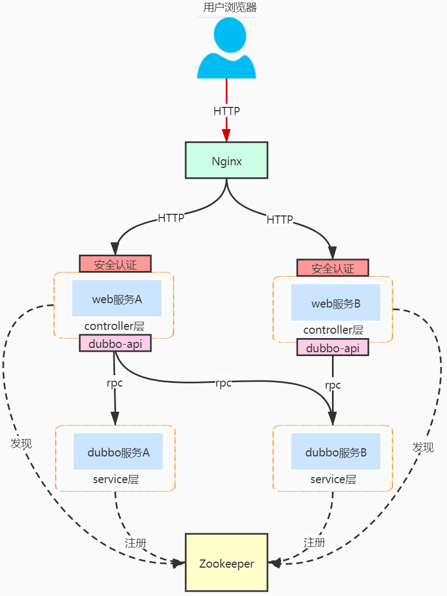
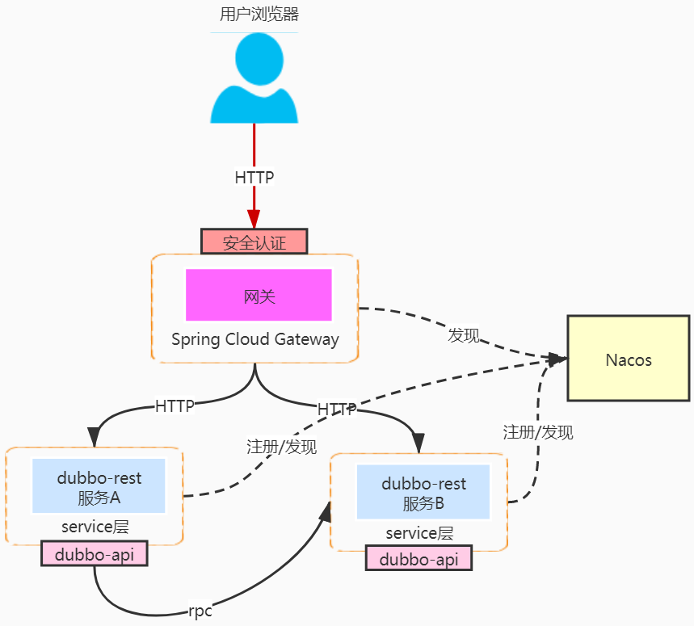

Spring Cloud(Spring Cloud Alibaba) + Dubbo + Gateway整合
-----------
# 1. 背景
在微服务架构中**API网关**非常重要，网关是全局流量入口。它具有下面这些作用:
- 反向代理: 根据不同的规则路由到不同的服务上。
- 共性提取: 可以把各个边缘服务(Web层)的各种共性需求抽取出来放在公共服务网关中
    * 安全认证
    * 权限控制
    * 限流熔断
    * 监控
    * 跨域处理
    * 聚合API文档
    * ......
    
用Dubbo框架体系来构建微服务架构，需要增加API网关，我们下面看看如何通过Nacos整合Spring Cloud Gateway和Dubbo服务。

# 2. 传统的dubbo架构

dubbo属于rpc调用，所以必须提供一个web层的服务作为http入口给客户端调用，并在上面提供安全认证等基础功能，而web层前面对接Nginx等反向代理用于统一入口和负载均衡。

> web层一般是根据业务模块来切分的，用于聚合某个业务模块所依赖的各个service服务

**PS**：我们能否把上图中的web层全部整合在一起成为一个API网关呢？(不建议这样做)

因为这样的web层并没有实现 **泛化调用** 必须引入所有dubbo服务的api依赖，会使得网关变得非常不稳定，任何服务的接口变更都需要修改网关中的api依赖！

# 3. 整合 Srping Cloud Gateway 网关

下面就开始聊聊直接拿热门的 `Srping Cloud Gateway` 来作为dubbo架构体系的网关是否可行，首先该API网关是属于 Spring Cloud 体系下的组件之一，要整合dubbo的话需要解决以下问题：

1. 打通注册中心：spring cloud gateway 需要通过注册中心发现下游服务，而 dubbo 也需要通过注册中心实现服务的注册与发现，如果两者的注册中心不能打通的话就会变成双注册中心架构就非常复杂了！
2. 协议转换： gateway 使用http传输协议调用下游服务，而dubbo服务默认使用的是tcp传输协议

> 上面提到的第一个问题“打通注册中心”其实已经不是问题了，目前dubbo支持 `Zookeeper` 与 `Nacos` 两个注册中心，而 Spring Cloud 自从把 `@EnableEurekaClient` 改为 `@EnableDiscoveryClient` 之后已经基本上支持所有主流的注册中心了，本文将使用 `Nacos` 作为注册中心打通两者

## 3.1 方式一: 使用Spring Cloud Gateway替换传统架构中Nginx的角色

把传统dubbo架构中的 `Nginx` 替换为 `Spring Cloud Gateway` ，并把 `安全认证` 等共性功能前移至网关处实现

> 由于web层服务本身提供的就是http接口，所以网关层无需作协议转换，但是由于 `安全认证` 前移至网关了需要通过网络隔离的手段防止被绕过网关直接请求后面的web层

## 3.2 方式二: 修改dubbo服务使其支持rest传输协议

dubbo服务本身修改或添加 `rest` 传输协议的支持，这样网关就可以通过http传输协议与dubbo服务通信了

> rest传输协议：基于标准的Java REST API——JAX-RS 2.0（Java API for RESTful Web Services的简写）实现的REST调用支持

> 目前版本的dubbo已经支持dubbo、rest、rmi、hessian、http、webservice、thrift、redis等10种传输协议了，并且还支持同一个服务同时定义多种协议，例如配置 protocol = { "dubbo", "rest" } 则该服务同时支持 `dubbo` 与 `rest` 两种传输协议

## 3.3 两种方式对比

**方式一** 对比 **方式二** 多了一层web服务所以多了一次网络调用开销，但是优点是各自的职责明确单一，web层可以作为聚合层用于聚合多个service服务的结果经过融合加工一并返回给前端，所以这种架构下能大大减少服务的 **循环依赖**

# 4. 整合实现
1. 用户服务(user-webservice): web封装的dubbo服务
2. 订单服务(order-webservice): web封装的dubbo服务，它RPC调用了user-webservice中的info接口，获取订单关联用户的用户信息
3. 用户暴露接口(user-api): 暴露了对外提供RPC服务的接口定义
4. 商品REST服务(product-restservice): 修改dubbo服务支持rest传输协议
5. 网关服务(haiya-gateway): 
   * 将/api/user/**转发给用户服务
   * 将/api/order/**转发给订单服务。
   * 将/api/product/**转发给商品服务
6. 公共模块(haiya-common): 封装了公共的请求和响应工具包

# 5. 总结
本篇文章介绍了Nacos作为服务注册和发现组件，进行Spring Cloud Gateway和Dubbo的整合。

虽然使用了两种方式进行了整合，但我们实际项目中更倾向于整合方式一，这样服务划分清晰，而且web层可以作为聚合Dubbo服务的一个聚合层存在，可以降低网关服务的复杂度，提高其扩展性。